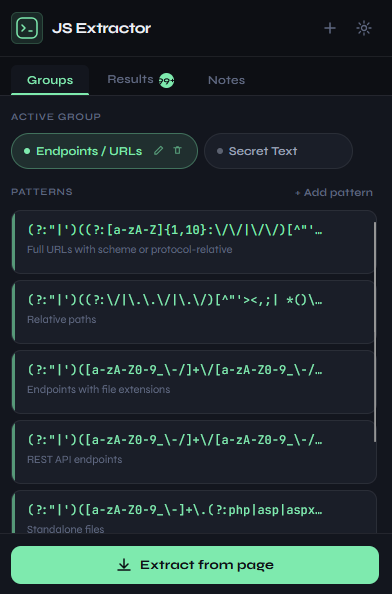
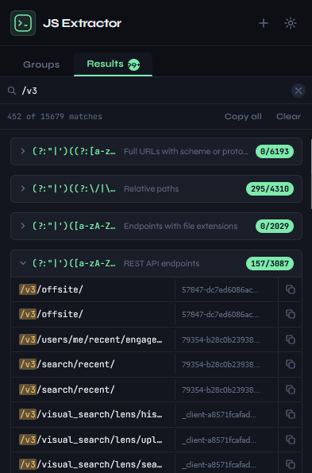
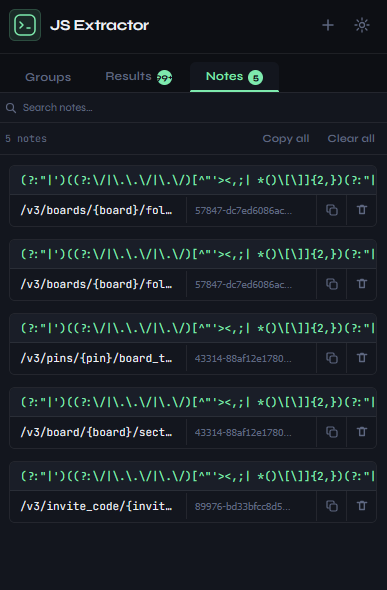

# JS Extractor

<p align="center">
  
</p>

<p align="center">
  <strong>A Firefox browser extension for extracting secrets, endpoints, and custom regex matches from JavaScript sources on any web page.</strong>
</p>

<p align="center">
  
  
  
</p>

---

## What It Does

JS Extractor scans **all JavaScript sources** on the current page — both inline `<script>` blocks and external `.js` files — and runs your regex patterns against them to extract matches. It's built for **bug bounty hunters**, **penetration testers**, and **security researchers** who need to quickly find:

- 🔗 **API endpoints & URLs** — REST paths, relative paths, full URLs, files with extensions
- 🔑 **Secrets & API keys** — AWS, Google, Stripe, GitHub, Slack, Firebase, JWT, and 80+ more
- 🔍 **Anything custom** — add your own regex patterns in organized groups

## Features

- **Pattern Groups** — Organize regex patterns into logical groups (e.g. "Endpoints", "Secrets")
- **90+ Built-in Secret Patterns** — Covering Google, AWS, Facebook, Stripe, GitHub, GitLab, Slack, Discord, database connection strings, private keys, JWTs, bearer tokens, and many more
- **5 Built-in Endpoint Patterns** — Full URLs, relative paths, REST APIs, file extensions, standalone files
- **Inline + External JS** — Extracts from both inline scripts and fetched external `.js` files
- **Search & Filter** — Search through results instantly
- **Copy Anywhere** — Copy individual values, source URLs, or all results at once
- **Collapsible Results** — Results grouped by pattern with expand/collapse
- **Paginated Results** — Handles 1000+ matches smoothly with "Show more" pagination
- **Saved Notes** — Bookmark matches directly to a persistent Notes tab for later review
- **Import / Export Groups** — Share and backup your pattern groups easily using YAML
- **Fully Customizable** — Create, edit, and delete your own groups and patterns
- **Dark Theme** — Premium dark UI built for long sessions

## Screenshots

<p align="center">
  
</p>

<p align="center">
  
</p>

<p align="center">
  
</p>

## Installation

### Permanent Install

[Firefox Add-ons](https://addons.mozilla.org/en-US/firefox/addon/js-extractor/)

### From Source (Developer Mode)

1. Clone or download this repository
2. Open Firefox and navigate to `about:debugging`
3. Click **"This Firefox"** → **"Load Temporary Add-on..."**
4. Select the `manifest.json` file from the project directory
5. The extension icon will appear in your toolbar

## Usage

1. **Navigate** to any web page you want to analyze
2. **Click** the JS Extractor icon in the toolbar
3. **Select** a pattern group (Endpoints / URLs or Secret Text) or create your own
4. **Click** "Extract from page"
5. **Browse** the results — search, copy values, copy source URLs
6. **Save to Notes** — click the bookmark icon next to any interesting match to automatically save it to your persistent Notes tab

### Creating Custom Patterns

1. Click the **+** button in the header to create a new group
2. Click **"+ Add pattern"** to add a regex pattern to the active group
3. Enter your regex and a description
4. Patterns are saved locally and persist across sessions

### Importing & Exporting Groups

You can backup or share your custom pattern groups using the **Import** and **Export** buttons located in the popup header next to the "New Group" button. 
- **Export**: Generates a `.yml` file backup of your active group.
- **Import**: Opens a modal where you can directly paste your YAML string to securely import a group.

The extension uses a simple, readable YAML format for groups:

```yaml
js-extractor:
  name: Group Name
  patterns:
    - regex: 'apiKey_[A-Za-z0-9]+'
      description: 'Example pattern description'
```

## Community Pattern Groups

Want to explore more patterns for specific frameworks, vulnerabilities, or technologies? 
Check out **[js-extractor-groups](https://github.com/rdzsp/js-extractor-groups)** — a community-driven collection of pattern groups that you can seamlessly import into JS Extractor. Contributions are highly encouraged!

## Built-in Patterns

### Endpoints / URLs (5 patterns)
| Pattern | Description |
|---------|-------------|
| Full URLs | URLs with scheme (`http://`, `https://`) or protocol-relative (`//`) |
| Relative paths | Paths starting with `/`, `../`, or `./` |
| File extensions | Endpoints ending in `.php`, `.asp`, `.json`, `.js`, etc. |
| REST API | REST-style multi-segment paths |
| Standalone files | Common server-side files with extensions |

### Secret Text (90 patterns)
| Category | Examples |
|----------|----------|
| Google | API Keys, OAuth tokens, reCAPTCHA keys, Cloud Platform |
| AWS | Access Key IDs, MWS tokens, S3 buckets, CloudFront URLs |
| Facebook | Access tokens, OAuth secrets |
| GitHub / GitLab | PATs, App tokens, Refresh tokens |
| Stripe / PayPal / Square | Live keys, sandbox tokens, OAuth secrets |
| Slack / Discord / Telegram | Bot tokens, webhooks |
| Twilio / SendGrid / Mailgun | API keys, Account SIDs |
| Database | MySQL, PostgreSQL, MongoDB, MSSQL, Redis connection strings |
| Cloud | Azure, Heroku, DigitalOcean, Firebase |
| Crypto Keys | RSA, DSA, EC, PGP, OpenSSH, PKCS8 private keys |
| Tokens | JWT, Bearer tokens, NPM/PyPI tokens |
| Credentials | Passwords, basic auth URLs, username/password pairs |
| Other | Mapbox, Algolia, Datadog, Shopify, New Relic, Dynatrace |

## Project Structure

```
js-extractor/
├── manifest.json       # Extension manifest (v2)
├── background.js       # Seeds default pattern groups on install
├── content.js          # Injected script — extracts matches from page JS
├── popup.html          # Extension popup UI structure
├── popup.css           # Dark theme styles
├── popup.js            # Popup logic — groups, patterns, results, search
└── icons/              # Extension icons (48px, 96px)
```

## How It Works

1. **Content Script** (`content.js`) is injected into every page at `document_idle`
2. When you click "Extract", the popup sends a message with the active group's patterns
3. The content script collects all JS sources:
   - Inline `<script>` blocks → reads `.textContent`
   - External `<script src="...">` → fetches via `fetch()` with cache
4. Each regex pattern is run against each source using `new RegExp(pattern, 'gm')`
5. Matches (with captured groups, source labels, and positions) are returned to the popup
6. Results are rendered with pagination (50 per batch) for performance

## Contributing

Contributions are welcome! Here are some ways you can help:

- 🐛 **Report bugs** — Open an issue if something doesn't work
- 📝 **Add patterns** — Submit PRs with new secret detection patterns
- ✨ **New features** — Suggest or implement new features
- 🎨 **UI improvements** — Help make the interface even better

### Development

1. Clone the repo
2. Load as a temporary add-on in Firefox (`about:debugging`)
3. Make changes — the popup reloads automatically when reopened
4. For `content.js` or `background.js` changes, reload the extension

## License

This project is licensed under the [MIT License](LICENSE).

---

<p align="center">
  Made for the security research community 🔐
</p>
